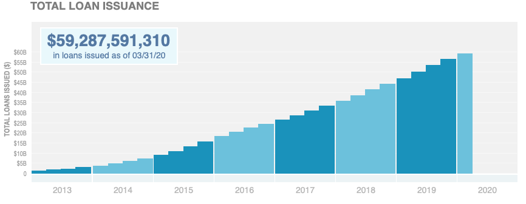
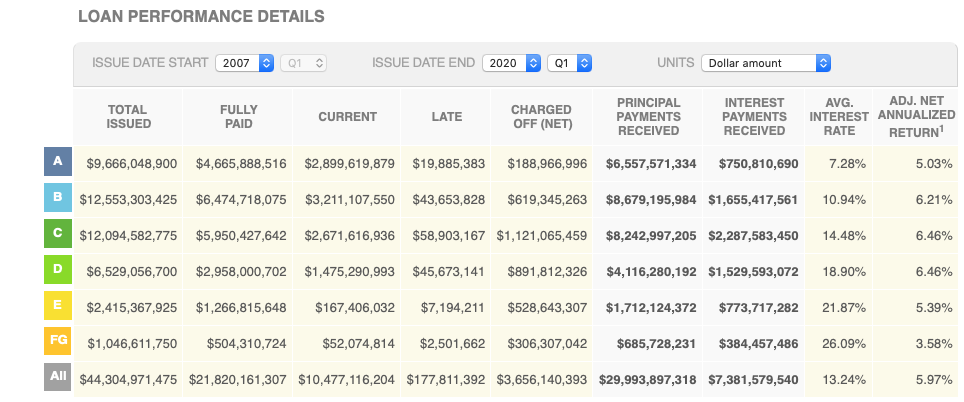

# Factors Associated with high likelyhood of full payment loan  : A Case Study with LendingClub Data

# Background

Built in 2007, [LendingClub](https://www.lendingclub.com) is the largest peer-to-peer lender that uses online services the practic lending money to individuals (or small business) matching anonymous lenders with borrowers. , as of March 2020, 59.29 billion dollars in loans had been originated troguth its platform. 

67.42% of the LendingClub borrowers report using their loans to refinance existing loans or pay off their credit cards as of 03/31/20. LendingClub issues loans between  1,000 and  4000 for duration of either 36 or 60 months. Last quarter, the average interest rate for 36-Month Loans were 11.77% and 60-Month Loans were 13.86%.

LendingClub categorizes its loans using a grading scheme (grades A, B, C, D, E, F, and G where grade A corresponds to the loans judged to be ‘‘safest’’ by LendingClub). Individual investors can browse loan listings online before deciding which loans(s) to invest in.Each loan is split into multiples of 25, called notes (e.g., for a 2,000 loan, there will be 80 notes of 25 each). As you can see from the chart below, the safer the loan the lower the interest rate, and so investors have to balance risk and return when deciding which loans to invest in.

The goal of this study is to analyze the factors associated with "good" loan, i.e. the loan with high likelyhood of full payment using the machine learning techniques. 

The process involved:

1. [Data Cleaning and Descriptive Analysis](#Data-Cleaning-and -Descriptive- Analysis) 
2. Classification 
3. Regression Modeling
4. Analytical Engineering
5. Calibration Curves
6. Evaluation of Model Performance

### Data Cleaning and Descriptive Analysis

Our data contain comprehensive information on all loans issued between 2014 and 2016. The data set includes hundreds of features, including the following fro each loan:

1. Interest Reate
2. Loan amount
3. Monthly Installment amount
4. Loan status (e.g. fully paid, default, charged-off)
5. Factors such as purpose of the loan, FICO score, employment length, home ownership, grade of the loan, 

We had total XXXX loans issued between 2014 and 2016. The missing data sets were assumed random and dropped from the analyses. We only consider only the loans that are expired, i.e. 5 months after the term of each loan ended. If the loan is fully paid, then the outcome variable "good loan" is coded as 1 and 0 other wise.  The final set of variables for 1,041,708 observations  are presented in the following descriptive tables.

| Variable      |  Mean (N)  | STD (%)    |
| :------------- | :----------: | -----------: |
|  Loan Amount |14,723   | 8,686    |
| Interst Rate   | 12.9| 4.5  |
|Annual Income| 77,111|71,617|
|Monthly Debt Payments/ Total Debt Obligations|18.73|9.31|
|High Fico Score|697.94|30.49|
|Low Fico Score|693.94|30.49|
|Credit History (Year)|16.65|7.61|
|Loan Length|25.04|10.58|
|Employment Legth (Year) |6.26|3.70|
|Home Own|116,153| 12%|
|Home Rent|413,806|39%
|Home Mortgage|511,750|49%|
|36 Month Loan|766,581| 74%|
|60 Month Loan|275,127| 26%|
|Income Verified|750330|72%|
|Individual Application| 1,033,631||99%|
|Good Loan| 840,793|81%|

From the table above, we can see that 81% of the loan is fully paid when the loan expired.  Most of the loans are individually applied (99%), 36 Month (74%), most of the applicants pay mortage (49%) with Fico scores close to 700. Average loan is around 15K with average interest rate 12.9%. 

The following table shows the purpose of the loans:

| Purpose     |  Frequency | 
| :------------- | :----------: | 
 | Credit Card |    237,310|
| Debt Consolidation |    612,347|
|        Educational |          1|
|   Home Improvement |     66,229|
|              House |      3,986|
 |    Major Purchase |     20,717|
 |           Medical |     11,303|
  |           Moving |      6,799|
   |           Other |     56,077|
 |  Renewable Energy |        635|
 |   Small Business |     10,035|
 |          Vacation |      6,574|
  |          Wedding |         14|
           
Most of the loans are used for debt consolidation (59%) and credit card payments (23%). LendingClub loan grade distribution for our datasets were as fallows:

| Grade     | Frequency  | 
| :------------- | :----------: | 
 |      A |    177,807|
 |        B |    302,463|
 |        C |    300,635|
 |        D |    155,573|
  |       E |     75,508|
 |        F |     23,699|
  |       G |      6,023|
        
Most of the loans were Grade B and C. This two group was about 58% of overall loans. Under each grade group, LendingClub further categories the loans into five categories according to its quality. For example, 177,807 Grade A loans further subcategorized as follows:

| Grade A    | Frequency  | 
| :------------- | :----------: | 
 |            A1 |     36,139|
 |       A2 |     27,291|
 |       A3 |     26,555|
 |       A4 |     38,710|
 |       A5 |     49,112|

