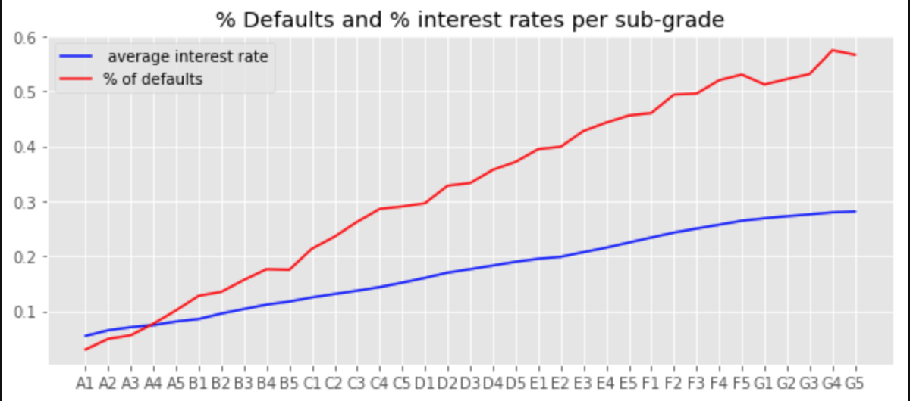
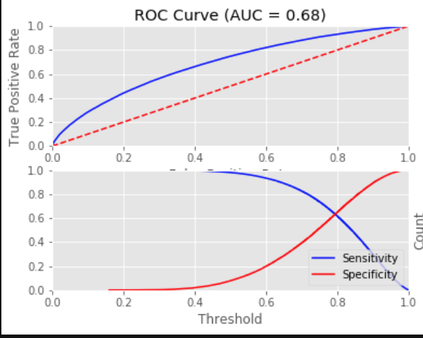

# Factors Associated with high likelyhood of full payment loan  : A Case Study with LendingClub Data

# Background

Built in 2007, [LendingClub](https://www.lendingclub.com) is the largest peer-to-peer lender that uses online services the practic lending money to individuals (or small business) matching anonymous lenders with borrowers. , as of March 2020, \\$59.29 billion in loans had been originated through its platform. 

67.42% of the LendingClub borrowers report using their loans to refinance existing loans or pay off their credit cards as of 03/31/20. LendingClub issues loans between  \\$1,000 and  \\$4,000 for duration of either 36 or 60 months. Last quarter, the average interest rate for 36-Month Loans were 11.77% and 60-Month Loans were 13.86%.

LendingClub categorizes its loans using a grading scheme (grades A, B, C, D, E, F, and G where grade A corresponds to the loans judged to be ‘‘safest’’ by LendingClub). Individual investors can browse loan listings online before deciding which loans(s) to invest in. Each loan is split into multiples of 25, called notes (e.g., for a 2,000 loan, there will be 80 notes of 25 each). As you can see from the chart below, the safer the loan the lower the interest rate, and so investors have to balance risk and return when deciding which loans to invest in.

The goal of this study is to analyze the factors associated with "good" loan, i.e. the loan with high likelyhood of full payment using the machine learning techniques. 

The process involved:

1. [Data Cleaning and Descriptive Analysis](#Data-Cleaning-and-Descriptive-Analysis) 
2. [Random Forest](#Random-Forest)
3. [Logistic Regression](#Logistic-Regression)
4. [Decision Tree](#Decision-Tree)
5. Calibration Curves
6. Evaluation of Model Performance

### Data Cleaning and Descriptive Analysis

Our data contain comprehensive information on all loans issued between 2014 and 2016. The data set includes hundreds of features, including the following fro each loan:

1. Interest Reate
2. Loan amount
3. Monthly Installment amount
4. Loan status (e.g. fully paid, default, charged-off)
5. Factors such as purpose of the loan, FICO score, employment length, home ownership, grade of the loan, 

We had total 1,091,131 loans issued between 2014 and 2016. The missing data sets were assumed random and dropped from the analyses. We only consider only the loans that are expired, i.e. 5 months after the term of each loan ended. If the loan is fully paid, then the outcome variable "good loan" is coded as 1 and 0 other wise.  The final set of variables for 1,040,752 observations  are presented in the following descriptive tables.

| Variable      |  Mean (N)  | STD (%)    |
| :------------- | :----------: | -----------: |
|  Loan Amount |\\$14,723   | 8,686    |
| Interst Rate   | 12.9| 4.5  |
|Annual Income| \\$77,111|71,617|
|Monthly Debt Payments/ Total Debt Obligations|18.73|9.31|
|High Fico Score|697.94|30.49|
|Low Fico Score|693.94|30.49|
|Credit History (Year)|16.65|7.61|
|Loan Length(Month)|25.04|10.58|
|Employment Legth (Year) |6.26|3.70|
|Home Own|116,153| 12%|
|Home Rent|413,806|39%
|Home Mortgage|511,750|49%|
|36 Month Loan|766,581| 74%|
|60 Month Loan|275,127| 26%|
|Income Verified|750330|72%|
|Individual Application| 1,033,631|99%|
|Good Loan| 840,793|81%|

From the table above, we can see that 81% of the loan is fully paid when the loan expired.  Most of the loans are individually applied (99%), 36 Month (74%), most of the applicants pay mortage (49%) with Fico scores close to 700. Average loan is around 15K with average interest rate 12.9%. 

The following table shows the purpose of the loans:

| Purpose     |  Frequency | 
| :------------- | :----------: | 
 | Credit Card |    237,310|
| Debt Consolidation |    612,347|
|        Educational |          1|
|   Home Improvement |     66,229|
|              House |      3,986|
 |    Major Purchase |     20,717|
 |           Medical |     11,303|
  |           Moving |      6,799|
   |           Other |     56,077|
 |  Renewable Energy |        635|
 |   Small Business |     10,035|
 |          Vacation |      6,574|
  |          Wedding |         14|
           
Most of the loans are used for debt consolidation (59%) and credit card payments (23%). LendingClub loan grade distribution for our datasets were as fallows:

| Grade     | Frequency  | 
| :------------- | :----------: | 
 |      A |    177,807|
 |        B |    302,463|
 |        C |    300,635|
 |        D |    155,573|
  |       E |     75,508|
 |        F |     23,699|
  |       G |      6,023|
        
Most of the loans were Grade B and C. This two group was about 58% of overall loans. Under each grade group, LendingClub further categories the loans into five categories according to its quality. For example, 177,807 Grade A loans further subcategorized as follows:

| Grade A    | Frequency  | 
| :------------- | :----------: | 
 |            A1 |     36,139|
 |       A2 |     27,291|
 |       A3 |     26,555|
 |       A4 |     38,710|
 |       A5 |     49,112|

The following graph shows the realtionship between different subgroups and average interest rate as well as percentage of defaults. The "safest" loan are less risky, therefore it offers lower interest rate and it has low default percentage. 

### Classification

We used random forest algorithms for classification. It is a ensemble learning method, composed of multiple decision trees. By averaging out the impact of several decsion trees, random forests tend to improve prediction. 

We are trying to predict whether the loan will be paid full. "Good Loan" is our dependent variable. We use train-test-split to split the data into training data and testing data. Total number of 1,040,752 observations are divided as follows: 780,564 oboservations in the training data and 260,188 data in the testing data. 

For 260,188 observations in testing data, 81% of them were good loan. Among the good loans, we were able to predict 98% correctly. Among the loans defaulted (49,900), our model predicted 92%. 

| | Predicted 0   | Predicted 1 | 
|:------ |:-------------: | :----------: | 
 |    Actual 0 |     3944| 45956|
 |      Actual 1 |   4340|205928|
 
 
 As presented in classification report below, accuracy score which is the fraction of samples predicted correctly is calculated as 0.81. 
 

|      | precision |   recall        | f1-score  | support|
|:-----:|:---------: |:-------------: | :----------: | :----------:|
| 0     |  0.48      |   0.08       |     0.14   |  49900|
| 1     |  0.82      |    0.98      | 0.89       | 210288
|accuracy  |         |              |     0.81   | 260188|
|   macro avg   |    0.65   |   0.53     | 0.51  |  260188|
|weighted avg    |   0.75   |   0.81  |    0.75  |  260188|

Precision is the ability of a classifier not to label and instance positive that is actually negative. For each class it is defined as the ratio of the true positives to the sum of true and false positives. Out of 8244 predicted default loan,  3944 of them were correct, therefore it was 0.48, and out of 251,884 predicted good loan, 205,928 of them were correct, i.e. 82%.

Recall is the ability of classifier to find all positive instances. Among the good loans, we were able to predict 98% correctly. Among the loans defaulted, our model predicted 8%. 

The f1-score is a weighted harmonic mean of precision and recall such that the best score is 1.0 and the worst is 0.0. As a rule of thumb, the weighted avearge of f1-score should be used to compare classifer models, not global accuracy. Therefore we for random forest's comparision score, we will use 0.75 to compare with the other models. 

Next, we looked at AUC (Area Under the Curve) - ROC (Receiver Operating Characteristics) curve. ROC is a probability curve and AUC represents degree or measure of separability.  According the figure below, AUC  is 0.68, therefore there is  68% chance that model will be able to distinguish between positive class and negative class.  

We also run the Random Forest model for each subcategories. AUC values ranged from 0.5228 to 0.5796. The mode was able best job to distinguish between positive class and negative class in E5 subgrade and worst job in A5 subgrade.

### Logistic Regression

We run logistic regression to determine which factors are more important at predicting a target variable, "good loan". The most important feature is identified as Annual Income, then in order we can say that credit history, interest rate of the loan, funded amount, and loan amount were most important factors. The table below show the top 5 important feature with their score. 

| Variable Name   | Score | 
| :------------- | :----------: | 
 |           Annual Income |    0.153|
 |    Credit History |   0.127|
 |      Interest Rate|    0.111|
 |      Funded Amount|    0.105|
 |      Loan Amount |  0.104|

### Decision Tree

Decision trees are supervised learning algorithm used for classification. The main idea of decision trees is to find those descriptive features which the most information regarding the target feature and the split the dataset along the values of these features such that the target feature values for the resulting sub datasetsare as pure as possible. 

The difference from Random Forest model that we applied befoe is that a decision tree is built on an entire dataset using all variables of interest whereas random forest randomly selects observations and specific features to built multiple decision trees from and the averages the results. 

